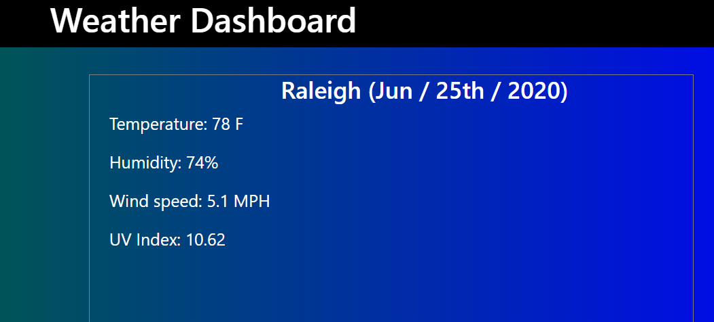

# Weather Dashboard
> The Weather Dashboard allows you to enter any city of your choice to view current weather conditions as well as the five day forecast.

## Description
This is a simple HTML, CSS, and JavaScript application that utilizes AJAX call's to pull information from the openweatherAPI.

## Screenshot(s)

## Development setup

Clone the repo to your local machine. Run the browser.

## Meta

Nicholas Finch
nicfinch223@gmail.com

[https://github.com/finch23](https://github.com/finch23)

## Contributing

1. Fork it (<https://github.com/yourname/yourproject/fork>)
2. Create your feature branch (`git checkout -b feature/fooBar`)
3. Commit your changes (`git commit -am 'Add some fooBar'`)
4. Push to the branch (`git push origin feature/fooBar`)
5. Create a new Pull Request
